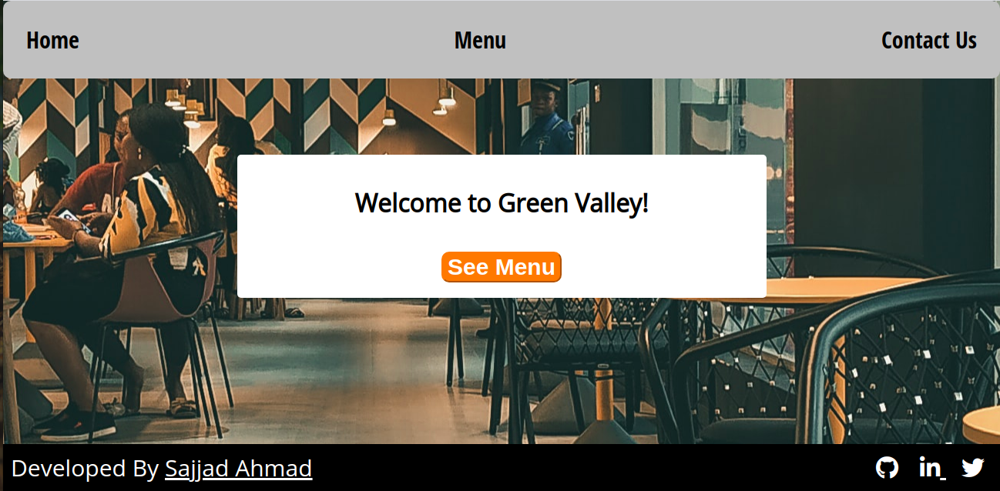

# Restaurant Site

> This repository contains source of a Restaurant Website named Green Valley.
 User can see all the foods on menu page and order a food.
 User can see contact details and site map on contact page.

## Set Up Project Locally

**To get this project set up on your local machine, follow these simple steps:**

**Step 1** 
Navigate through the local folder where you want to clone the repository and run 
`git@github.com:SajjadAhmad14/Js-Resturant-Page.git` to clone the repo to your local folder. 
or with https 
`https://github.com/SajjadAhmad14/Js-Resturant-Page.git`. 
**Step 2** 
Run `cd Js-Resturant-Page` 
**Step 2** 
Run `npm install` 

## Built With

- Javascript
- Webpack
- HTML
- VScode

## Live Demo

<a href = 'https://greenontop.netlify.app/' target = 'blank'>Green Valley</a>

## Authors

👤 **Sajjad Ahmad**

- GitHub: [@githubhandle](https://github.com/SajjadAhmad14)
- Twitter: [@twitterhandle](https://twitter.com/Sajjad_Ahmad14)
- LinkedIn: [LinkedIn](https://www.linkedin.com/in/sajjadahmad14)

## 🤝 Contributing

Contributions, issues, and feature requests are welcome!

Feel free to check the [issues page](https://github.com/SajjadAhmad14/Js-Resturant-Page/issues).

## Show your support

Give a ⭐️ if you like this project!

## 📝 License

This project is [MIT](lic.url) licensed.